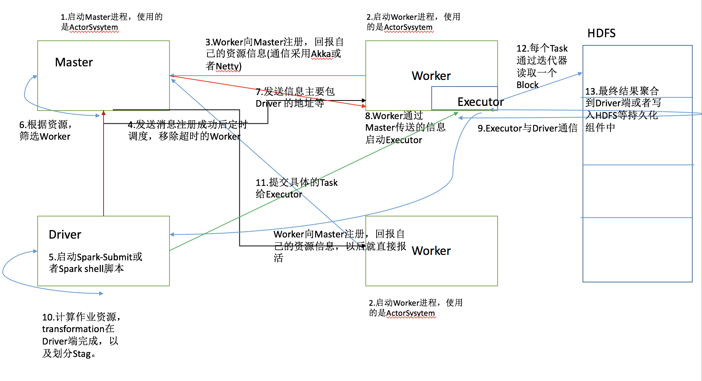

# Spark(基于1.3.1)源码分析
&nbsp;&nbsp;&nbsp;&nbsp;&nbsp;&nbsp;&nbsp;主要针对于Spark源码分析，对于比较重要的方法和代码,有注释,在熟悉Spark源码之前,首先必须了解Akka的通信,

如果不了解的可以看一下我的Demo,点击这里[SPRC](https://github.com/oeljeklaus-you/SPRC) ,这里主要进行的源码分析是:Spark集群启动的脚本、Spark作业

提交的脚本、Spark作业提交中SparkContext、Spark中SparkContext、Executor进程启动的流程和结合简单的WordCount

程序对于RDD执行流程进行剖析以及进行Stage划分分析和Task提交，最后也含有Spark2.0的新特性。
## 启动的脚本
在分析源代码以前,需要首先了解Spark启动脚本做了什么?如果了解这部分流程,这里直接跳过，需要详细了解的可以点击这里查看:
[Spark启动脚本详解](https://github.com/oeljeklaus-you/SparkCore/blob/master/md/Spark启动脚本详解.md)
## Spark执行流程

执行流程描述:

1.通过Shell脚本启动Master，Master类继承Actor类，通过ActorySystem创建并启动。

2.通过Shell脚本启动Worker，Worker类继承Actor类，通过ActorySystem创建并启动。

3.Worker通过Akka或者Netty发送消息向Master注册并汇报自己的资源信息(内存以及CPU核数等)，以后就是定时汇报，保持心跳。

4.Master接受消息后保存(源码中通过持久化引擎持久化)并发送消息表示Worker注册成功，并且定时调度，移除超时的Worker。

5.通过Spark-Submit提交作业或者通过Spark Shell脚本连接集群，都会启动一个Spark进程Driver。

6.Master拿到作业后根据资源筛选Worker并与Worker通信，发送信息，主要包含Driver的地址等。

7.Worker进行收到消息后，启动Executor，Executor与Driver通信。

8.Driver端计算作业资源，transformation在Driver 端完成，划分各个Stage后提交Task给Executor。

9.Exectuor针对于每一个Task读取HDFS文件，然后计算结果，最后将计算的最终结果聚合到Driver端或者写入到持久化组件中。

## SparkContext内部执行流程
关于SparkContext的流程细节，可以点击这个文件[SparkContext流程](https://github.com/oeljeklaus-you/SparkCore/blob/master/md/SparkContext流程.md)

这里涉及SparkEnv的创建,DriverActor、ClientActor、TaskScheduler和DAGScheduler的创建以及资源分配算法。

可以学习到的知识点:

1.创建SparkEnv，里面有一个很重要的对象ActorSystem

2.创建TaskScheduler,这里是根据提交的集群来创建相应的TaskScheduler

3.对于TaskScheduler,主要的任务调度模式有FIFO和FAIR

4.在SparkContext中创建了两个Actor,一个是DriverActor,这里主要用于Driver和Executor之间的通信;还有一个是ClientActor,主要用于Driver和Master之间的通信。

5.创建DAGScheduler,其实这个是用于Stage的划分

6.调用taskScheduler.start()方法启动,进行资源调度,有两种资源分配方法,一种是尽量打散;一种是尽量集中

7.Driver向Master注册,发送了一些信息,其中一个重要的类是CoarseGrainedExecutorBackend,这个类以后用于创建Executor进程。

## Executor启动流程
对于Executor启动流程不熟悉的,可以查看[Executor启动流程](https://github.com/oeljeklaus-you/SparkCore/blob/master/md/Executor启动流程.md)文件。

主要涉及Executor进程如何启动、Executor内部方法。

可以学习到的知识:

1.Worker创建Executor进程,该进程的实现类其实是CoarseGrainedExecutorBackend

2.CoarseGrainedExecutorBackend向DriverActor注册成功后创建Executor对象,内部有一个可变的线程池

3.执行makeOffers()方法，查看是否有任务需要提交
## 结合WordCount的Stage划分
关于WordCount的划分，这里结合了一个简单的案例WordCount进行分析，如果想详细了解Stage划分的过程，可以点击

这个文件[结合WordCount的Stage划分](https://github.com/oeljeklaus-you/SparkCore/blob/master/md/结合WordCount的Stage划分.md)  进行学习。

涉及RDD知识讲解,Stage划分算法,Stage提交算法,RDD依赖关系。

可以学习到的知识:

1.textFile()方法会产生两个RDD,HadoopRDD和MapPartitionRDD 

2.saveTextAsFile()方法会产生一个RDD,MapPartitionRDD 

3.Task数量取决于HDFS分区数量 

4.Stage划分是通过最后的RDD,也就是final RDD根据依赖关系进行递归划分 

5.stage提交主要是通过递归算法,根据最后一个Stage划分然后递归找到第一个stage开始从第一个stage开始提交。
## 任务提交流程
任务如何提交、如何在Spark内部执行，这个文件[任务提交流程](https://github.com/oeljeklaus-you/SparkCore/blob/master/md/任务提交流程.md)详解讲解了
Task如何提交到Executor执行。

可以学习到的知识:

1.提交Task主要是迭代TaskSet一个一个的取出Task进行序列化之后向Executor发送序列化好的Task

2.Executor执行Task,创建一个TaskRunner对象将Task的信息封装信息然后使用线程池执行

## Spark2.0新特性
