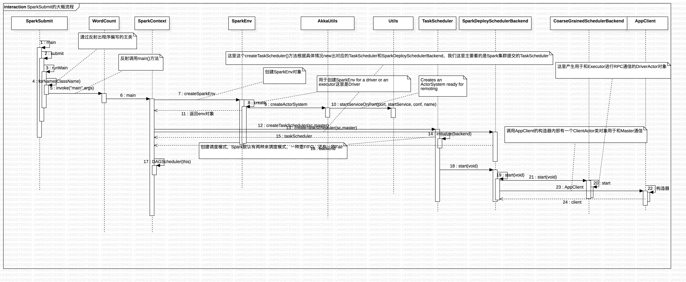
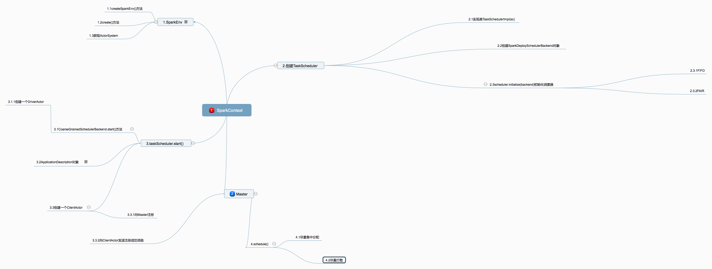

# SparkContext内部执行流程
## SparkContext内部执行的时序图

对于这个时序图的具体描述如下:

1.SparkSubmit在main()方法中执行，然后根据提交的类型调用相应的方法，这里是"Submit"，调用submit()方法，submit()里面进行一些判断后，

使用反射Class.forName(childMainClass, true, loader)，然后调用invoke()方法来调用程序员自己写的类，我们这里是WordCount。

2.在WordCount类中，main()方法里有调用SparkContext，SparkContext构造器使用createSparkEnv()方法，

这个方法使用SparkEnv.createDriverEnv(conf, isLocal, listenerBus)方法创建SparkEnv对象；

在SparkEnv类，调用create()方法来进行创建SparkEnv，在这个方法内部，有一个

AkkaUtils.createActorSystem(actorSystemName, hostname, port, conf, securityManager)的调用过程，

主要用来产生Akka中的ActorSystem以及得到绑定的端口号。

3.在创建SparkEnv对象后，SparkContext构造器使用代码SparkContext.createTaskScheduler(this, master)创建TaskScheduler对象，

这里根据实际的提交模式来进行创建TaskScheduler对象，提交模式有:local、Mesos、Zookeeper、Simr、Spark，

这里模们主要分析Spark集群下的模式；然后还需要创建一个SparkDeploySchedulerBackend对象；

在创建TaskScheduler对象调用initialize()方法，这里选择调度模式，主要有两种模式，FIFO和FAIR，默认的调度模式；

最后调用taskScheduler的start()方法，里面主要调用SparkDeploySchedulerBackend对象的start()方法，

首先调用父类的start()方法产生一个用于和Executor通信的DriverActor对象，然后里面主要创建一个AppClient对象内部有ClientActor类对象，

用于Driver和Master进行RPC通信。

## SparkContext源码分析流程
### 1.SparkSubmit半生对象的源码
**1.1SparkSubmit的main()函数在SparkSubmit半生对象的104行左右**，这个是程序的主要入口:
<pre><code>
 //TODO 程序执行的主入口，然后根据提交参数的类型进行模式匹配
  def main(args: Array[String]): Unit = {
    val appArgs = new SparkSubmitArguments(args)
    if (appArgs.verbose) {
      printStream.println(appArgs)
    }
    //TODO 进行模式匹配,这里主要看submit用例类
    appArgs.action match {
      case SparkSubmitAction.SUBMIT => submit(appArgs)
      case SparkSubmitAction.KILL => kill(appArgs)
      case SparkSubmitAction.REQUEST_STATUS => requestStatus(appArgs)
    }
  }
</code></pre>
接下来主要进入submit()方法，下面是submit()方法

**1.2SparkSubmit的submit()方法,代码大约在142行左右**, 这个方法的主要作用是根据不同的模式使用runMain()方法:
<pre><code>
private[spark] def submit(args: SparkSubmitArguments): Unit = {
    val (childArgs, childClasspath, sysProps, childMainClass) = prepareSubmitEnvironment(args)

    def doRunMain(): Unit = {
      if (args.proxyUser != null) {
        val proxyUser = UserGroupInformation.createProxyUser(args.proxyUser,
          UserGroupInformation.getCurrentUser())
        try {
          proxyUser.doAs(new PrivilegedExceptionAction[Unit]() {
            override def run(): Unit = {
              runMain(childArgs, childClasspath, sysProps, childMainClass, args.verbose)
            }
          })
        } catch {
          case e: Exception =>
            // Hadoop's AuthorizationException suppresses the exception's stack trace, which
            // makes the message printed to the output by the JVM not very helpful. Instead,
            // detect exceptions with empty stack traces here, and treat them differently.
            if (e.getStackTrace().length == 0) {
              printStream.println(s"ERROR: ${e.getClass().getName()}: ${e.getMessage()}")
              exitFn()
            } else {
              throw e
            }
        }
      } else {
        runMain(childArgs, childClasspath, sysProps, childMainClass, args.verbose)
      }
    }

     // In standalone cluster mode, there are two submission gateways:
     //   (1) The traditional Akka gateway using o.a.s.deploy.Client as a wrapper
     //   (2) The new REST-based gateway introduced in Spark 1.3
     // The latter is the default behavior as of Spark 1.3, but Spark submit will fail over
     // to use the legacy gateway if the master endpoint turns out to be not a REST server.
    if (args.isStandaloneCluster && args.useRest) {
      try {
        printStream.println("Running Spark using the REST application submission protocol.")
        doRunMain()
      } catch {
        // Fail over to use the legacy submission gateway
        case e: SubmitRestConnectionException =>
          printWarning(s"Master endpoint ${args.master} was not a REST server. " +
            "Falling back to legacy submission gateway instead.")
          args.useRest = false
          submit(args)
      }
    // In all other modes, just run the main class as prepared
    } else {
      doRunMain()
    }
  }
</code></pre>
**1.3SparkSubmit的runMain()方法,代码大约在505行左右**,这个方法主要的主要作用是**通过反射获取自定义类,这里我们主要的是WordCount，然后通过invoke方法调用main**
这里是方法的重要代码:
<pre><code>
  //代码大约在539行左右
  try {
      //TODO 通过反射出我们的类
      mainClass = Class.forName(childMainClass, true, loader)
    } catch {
      case e: ClassNotFoundException =>
        e.printStackTrace(printStream)
        if (childMainClass.contains("thriftserver")) {
          printStream.println(s"Failed to load main class $childMainClass.")
          printStream.println("You need to build Spark with -Phive and -Phive-thriftserver.")
        }
        System.exit(CLASS_NOT_FOUND_EXIT_STATUS)
    }
    
  //TODO 通过反射调用WordCount的main()方法
   try {
      mainMethod.invoke(null, childArgs.toArray)
      } catch {
         case t: Throwable =>
         throw findCause(t)
      }
</code></pre>
调用WordCount的main()方法后,接下来就要看SparkContext的内部了。
### 2.SparkContext内部源码分析
很重要：SparkContext是Spark提交任务到集群的入口

我们看一下SparkContext的主构造器

1.调用createSparkEnv方法创建SparkEnv，里面有一个非常重要的对象ActorSystem

2.创建TaskScheduler -> 根据提交任务的URL进行匹配 -> TaskSchedulerImpl -> SparkDeploySchedulerBackend(里面有两个Actor)

3.创建DAGScheduler

**2.1创建SparkEnv获取ActorSystem,代码大约在275行左右**,这一步的主要的作用是**创建ActorSystem对象以后根据这个对象来创建相应的Actor**
<pre><code>
 //TODO 该方法创建了一个SparkEnv
  private[spark] def createSparkEnv(
      conf: SparkConf,
      isLocal: Boolean,
      listenerBus: LiveListenerBus): SparkEnv = {
    SparkEnv.createDriverEnv(conf, isLocal, listenerBus)
  }
</code></pre>
主要调用SparkEnv类的createDriverEnv()方法获取SparkEnv对象,createDriverEnv()主要调用SparkEnv的create()方法，这里代码大约

在**SparkEnv的154行**，代码具体如下:
<pre><code>
private[spark] def createDriverEnv(
      conf: SparkConf,
      isLocal: Boolean,
      listenerBus: LiveListenerBus,
      mockOutputCommitCoordinator: Option[OutputCommitCoordinator] = None): SparkEnv = {
    assert(conf.contains("spark.driver.host"), "spark.driver.host is not set on the driver!")
    assert(conf.contains("spark.driver.port"), "spark.driver.port is not set on the driver!")
    val hostname = conf.get("spark.driver.host")
    val port = conf.get("spark.driver.port").toInt
    //TODO 调用create()方法
    create(
      conf,
      SparkContext.DRIVER_IDENTIFIER,
      hostname,
      port,
      isDriver = true,
      isLocal = isLocal,
      listenerBus = listenerBus,
      mockOutputCommitCoordinator = mockOutputCommitCoordinator
    )
  }
</code></pre>
createDriverEnv()内部主要调用create()方法,**代码大约在202行**,重要的代码如下:
<pre><code>
// Create the ActorSystem for Akka and get the port it binds to.
    val (actorSystem, boundPort) = {
      val actorSystemName = if (isDriver) driverActorSystemName else executorActorSystemName
      //TODO 利用AkkaUtils这个工具类创建ActorSystem
      AkkaUtils.createActorSystem(actorSystemName, hostname, port, conf, securityManager)
    }
</code></pre>
这个方法的主要作用是**调用AkkaUtils这个工具类创建ActorSystem**。

**2.2创建TaskScheduler,代码大约在374行**,重要的代码如下:
<pre><code>
//TODO 创建一个TaskScheduler
  private[spark] var (schedulerBackend, taskScheduler) =
    SparkContext.createTaskScheduler(this, master)
</code></pre>
这里调用createTaskScheduler()方法，这个类主要的作用是**根据提交的类型创建相应的TaskScheduler()**，这里主要分析Spark集群下，主要的代码如下:
<pre><code>
      //TODO spark的StandAlone模式
      case SPARK_REGEX(sparkUrl) =>
        //TODO 创建了一个TaskSchedulerImpl
        val scheduler = new TaskSchedulerImpl(sc)
        val masterUrls = sparkUrl.split(",").map("spark://" + _)
        //TODO 创建了一个SparkDeploySchedulerBackend
        val backend = new SparkDeploySchedulerBackend(scheduler, sc, masterUrls)
        //TODO 调用initialize创建调度器
        scheduler.initialize(backend)
        (backend, scheduler)
</code></pre>
这里进行模式匹配,**以上代码大约在SparkContext的2159行,主要的作用是创建TaskSchedulerImpl对象,然后初始化调度器**这里,需要看的是initialize(),主要的实现是

TaskSchedulerImpl类,这里我们将会深入TaskSchedulerImpl类的initialize()方法,下面是该方法的实现:
<pre><code>
//TODO 初始化任务调度器
  def initialize(backend: SchedulerBackend) {
    this.backend = backend
    // temporarily set rootPool name to empty
    rootPool = new Pool("", schedulingMode, 0, 0)
    schedulableBuilder = {
      schedulingMode match {
        case SchedulingMode.FIFO =>
          new FIFOSchedulableBuilder(rootPool)
        case SchedulingMode.FAIR =>
          new FairSchedulableBuilder(rootPool, conf)
      }
    }
    schedulableBuilder.buildPools()
  }
</code></pre>
主要用于调度的模式,**调度模式主要分为FIFO和FAIR**。在进行创建了TaskScheduler对象后,我们再来看一下主要的代码:
<pre><code>
//TODO 创建一个TaskScheduler
  private[spark] var (schedulerBackend, taskScheduler) =
    SparkContext.createTaskScheduler(this, master)
  //TODO 通过ActorSystem创建了一个Actor，这个心跳是Executors和DriverActor的心跳
  private val heartbeatReceiver = env.actorSystem.actorOf(
    Props(new HeartbeatReceiver(taskScheduler)), "HeartbeatReceiver")
  @volatile private[spark] var dagScheduler: DAGScheduler = _
  try {
    //TODO 创建了一个DAGScheduler，以后用来把DAG切分成Stage
    dagScheduler = new DAGScheduler(this)
  } catch {
    case e: Exception => {
      try {
        stop()
      } finally {
        throw new SparkException("Error while constructing DAGScheduler", e)
      }
    }
  }
</code></pre>
上述代码中,这里主要用于创建一个HeartbeatReceiver对象来进行心跳,用于Executors和DriverActor的心跳。

然后创建DAGScheduler对象,这个对象的主要作用是用来划分Stage。

**2.3TaskScheduler进行启动,代码大约在395行**,重要的代码如下:
<pre><code>
//TODO 启动taskScheduler
taskScheduler.start()
</code></pre>
由于这里是TaskScheduler的主要的实现类是TaskScheduler是TaskSchedulerImpl类,我们要进入的源码是:
<pre><code>
override def start() {
    //TODO 首先掉用SparkDeploySchedulerBackend的start方法
    backend.start()

   if (!isLocal && conf.getBoolean("spark.speculation", false)) {
      logInfo("Starting speculative execution thread")
      import sc.env.actorSystem.dispatcher
      sc.env.actorSystem.scheduler.schedule(SPECULATION_INTERVAL milliseconds,
            SPECULATION_INTERVAL milliseconds) {
        Utils.tryOrExit { checkSpeculatableTasks() }
      }
    }
  }
</code></pre>
主要调用了SparkDeploySchedulerBackend的start()方法,接下来我们需要看SparkDeploySchedulerBackend内部实现。

以下是SparkDeploySchedulerBackend的构造器函数,**这个代码大约在SparkDeploySchedulerBackend的45行**重要的代码如下:
<pre><code>
 override def start() {
    //TODO 首先调用父类的start方法来创建DriverActor
    super.start()

    // The endpoint for executors to talk to us
    //TODO 准备一些参数，以后把这些参数封装到一个对象中，然后将该对象发送给Master
    val driverUrl = AkkaUtils.address(
      AkkaUtils.protocol(actorSystem),
      SparkEnv.driverActorSystemName,
      conf.get("spark.driver.host"),
      conf.get("spark.driver.port"),
      CoarseGrainedSchedulerBackend.ACTOR_NAME)
    val args = Seq(
      "--driver-url", driverUrl,
      "--executor-id", "{{EXECUTOR_ID}}",
      "--hostname", "{{HOSTNAME}}",
      "--cores", "{{CORES}}",
      "--app-id", "{{APP_ID}}",
      "--worker-url", "{{WORKER_URL}}")
    val extraJavaOpts = sc.conf.getOption("spark.executor.extraJavaOptions")
      .map(Utils.splitCommandString).getOrElse(Seq.empty)
    val classPathEntries = sc.conf.getOption("spark.executor.extraClassPath")
      .map(_.split(java.io.File.pathSeparator).toSeq).getOrElse(Nil)
    val libraryPathEntries = sc.conf.getOption("spark.executor.extraLibraryPath")
      .map(_.split(java.io.File.pathSeparator).toSeq).getOrElse(Nil)

    // When testing, expose the parent class path to the child. This is processed by
    // compute-classpath.{cmd,sh} and makes all needed jars available to child processes
    // when the assembly is built with the "*-provided" profiles enabled.
    val testingClassPath =
      if (sys.props.contains("spark.testing")) {
        sys.props("java.class.path").split(java.io.File.pathSeparator).toSeq
      } else {
        Nil
      }

    // Start executors with a few necessary configs for registering with the scheduler
    val sparkJavaOpts = Utils.sparkJavaOpts(conf, SparkConf.isExecutorStartupConf)
    val javaOpts = sparkJavaOpts ++ extraJavaOpts
    //TODO 重要：这个参数是以后Executor的实现类
    val command = Command("org.apache.spark.executor.CoarseGrainedExecutorBackend",
      args, sc.executorEnvs, classPathEntries ++ testingClassPath, libraryPathEntries, javaOpts)
    val appUIAddress = sc.ui.map(_.appUIAddress).getOrElse("")
    //TODO 把参数封装到ApplicationDescription
    val appDesc = new ApplicationDescription(sc.appName, maxCores, sc.executorMemory, command,
      appUIAddress, sc.eventLogDir, sc.eventLogCodec)
    //TODO 创建一个AppClient把ApplicationDescription通过主构造器传进去
    client = new AppClient(sc.env.actorSystem, masters, appDesc, this, conf)
    //TODO 然后调用AppClient的start方法，在start方法中创建了一个ClientActor用于与Master通信
    client.start()

    waitForRegistration()
  }
</code></pre>
从上面的代码可以看出首先调用父类(**CoarseGrainedSchedulerBackend**)的start()方法,然后对于一些重要的参数进行封装,这里最重要的参数是

CoarseGrainedExecutorBackend类，还有一些driverUrl和WORKER_URL等参数的封装,将CoarseGrainedExecutorBackend

封装成Command,这是一个样例类,不知道样例类[请点击这里](https://blog.csdn.net/oeljeklaus/article/details/80559180),将这个参数封装成为一个

ApplicationDescription对象，创建一个AppClient对象,这个对象主要用于Driver和Master之间的通信,以下我们分析start()方法后再分析client.start()。
<pre><code>
override def start() {
    val properties = new ArrayBuffer[(String, String)]
    for ((key, value) <- scheduler.sc.conf.getAll) {
      if (key.startsWith("spark.")) {
        properties += ((key, value))
      }
    }
    // TODO (prashant) send conf instead of properties
    // TODO　通过ActorSystem创建DriverActor
    driverActor = actorSystem.actorOf(
      Props(new DriverActor(properties)), name = CoarseGrainedSchedulerBackend.ACTOR_NAME)
  }
</code></pre>
可以从上面的代码看出, **这里主要创建一个DriverActor，这个Actor的主要的作用是Driver进程和Executor进程进行RPC通信**

在分析完以上的CoarseGrainedSchedulerBackend的start()方法后,这里主要进行的源码分析是client.start()方法这里创建一个ClientActor,准确来说是这个

ClientActor来和Master通信。

现在,这里就调用ClientActor的生命周期方法，对于Akka通信不了解的,[请点击这里](https://github.com/oeljeklaus-you/SPRC)进行了解Actor的生命周期方法。

**Akka的Actor的生命周期方法主要从preStart()方法开始，这行代码大约在67行左右**,主要的内容如下:
<pre><code>
//TODO ClientActor的生命周期方法
    override def preStart() {
      context.system.eventStream.subscribe(self, classOf[RemotingLifecycleEvent])
      try {
        //TODO ClientActor向Master注册
        registerWithMaster()
      } catch {
        case e: Exception =>
          logWarning("Failed to connect to master", e)
          markDisconnected()
          context.stop(self)
      }
    }
</code></pre>

在preStart()方法中主要做的事情是向Master注册,registerWithMaster()的主要内容是:
<pre><code>
 def tryRegisterAllMasters() {
      for (masterAkkaUrl <- masterAkkaUrls) {
        logInfo("Connecting to master " + masterAkkaUrl + "...")
        //TODO 循环所有Master地址，跟Master建立连接
        val actor = context.actorSelection(masterAkkaUrl)
        //TODO 拿到了Master的一个引用，然后向Master发送注册应用的请求，所有的参数都封装到appDescription
        actor ! RegisterApplication(appDescription)
      }
    }

   def registerWithMaster() {
      //TODO 向Master注册
      tryRegisterAllMasters()
      import context.dispatcher
      var retries = 0
      registrationRetryTimer = Some {
        context.system.scheduler.schedule(REGISTRATION_TIMEOUT, REGISTRATION_TIMEOUT) {
          Utils.tryOrExit {
            retries += 1
            if (registered) {
              registrationRetryTimer.foreach(_.cancel())
            } else if (retries >= REGISTRATION_RETRIES) {
              markDead("All masters are unresponsive! Giving up.")
            } else {
              tryRegisterAllMasters()
            }
          }
        }
      }
    }
</code></pre>
这个方法主要是向活着的Master进行注册,将以前所有的参数封装的appDescription发送给Master，然后启动定时调度器进行和Master的注册,因为有可能进行多次通信。

Master收到通过样例类的模式匹配,对于Driver向Master注册Application,主要的作用是**持久化Driver传递的参数和进行资源调度**.

主要的**代码大约在Master类的315行**,主要的代码如下:
<pre><code>
   //TODO ClientActor发送过来的注册应用的消息
    case RegisterApplication(description) => {
      if (state == RecoveryState.STANDBY) {
        // ignore, don't send response
      } else {
        logInfo("Registering app " + description.name)
        //TODO 首先把应用的信息放到内存中存储
        val app = createApplication(description, sender)
        registerApplication(app)
        logInfo("Registered app " + description.name + " with ID " + app.id)
        //TODO 利用持久化引擎保存
        persistenceEngine.addApplication(app)
        //TODO Master向ClientActor发送注册成功的消息
        sender ! RegisteredApplication(app.id, masterUrl)
        //TODO 重要：Master开始调度资源，其实就是把任务启动到哪些Worker上
        schedule()
      }
    }
</code></pre>
这段代码的意义是:持久化信息,告知ClientActor发送注册成功的信息,然后适使用schedule()进行资源的调度。

对于schedule()方法，代码大约在533行,这里的主要作用是**进行资源调度,主要的是两种资源调度的方法,一种是尽量打散的分配资源,还有一种是尽量集中**。
<pre><code>
 //TODO 下面是两种调度方式，一中是尽量打散，另一种是尽量集中
    // Right now this is a very simple FIFO scheduler. We keep trying to fit in the first app
    // in the queue, then the second app, etc.
    if (spreadOutApps) {
      // Try to spread out each app among all the nodes, until it has all its cores
      for (app <- waitingApps if app.coresLeft > 0) {
        val usableWorkers = workers.toArray.filter(_.state == WorkerState.ALIVE)
          .filter(canUse(app, _)).sortBy(_.coresFree).reverse
        val numUsable = usableWorkers.length
        val assigned = new Array[Int](numUsable) // Number of cores to give on each node
        var toAssign = math.min(app.coresLeft, usableWorkers.map(_.coresFree).sum)
        var pos = 0
        while (toAssign > 0) {
          if (usableWorkers(pos).coresFree - assigned(pos) > 0) {
            toAssign -= 1
            assigned(pos) += 1
          }
          pos = (pos + 1) % numUsable
        }
        // Now that we've decided how many cores to give on each node, let's actually give them
        for (pos <- 0 until numUsable) {
          if (assigned(pos) > 0) {
            val exec = app.addExecutor(usableWorkers(pos), assigned(pos))
            //TODO Master发送消息让Worker启动Executor
            launchExecutor(usableWorkers(pos), exec)
            app.state = ApplicationState.RUNNING
          }
        }
      }
    } else {
      // Pack each app into as few nodes as possible until we've assigned all its cores
      for (worker <- workers if worker.coresFree > 0 && worker.state == WorkerState.ALIVE) {
        for (app <- waitingApps if app.coresLeft > 0) {
          if (canUse(app, worker)) {
            val coresToUse = math.min(worker.coresFree, app.coresLeft)
            if (coresToUse > 0) {
              val exec = app.addExecutor(worker, coresToUse)
              //TODO Master发送消息让Worker启动Executor
              launchExecutor(worker, exec)
              //TODO 改变应用的状态
              app.state = ApplicationState.RUNNING
            }
          }
        }
      }
    }
</code></pre>
**对于尽量打散的方式:将每个app分配到尽可能多的worker中执行**

App调度时会为app分配满足条件的资源-----Worker（State是Alive，其上并没有该Application的executor，可用内存满足要求(spark.executor.memory指定，默认512), 

核满足要求(spark.cores.max, 最大可用core数，若未指定，则为全部资源)），然后通知Woker启动Excutor. 及向AppClient发送ExecutorAdded消息。

进行调度时，调度程序会根据配制SpreadOutApps = spark.deploy.spreadOut情况决定资源分配方式。

1 从列表中取下一app，根据CPU情况找出合适的woker,按核从小到大排序

2 如果worker节点存在可以分配的core 则进行预分配处理（轮循一次分一个直至满足app需求），并在分配列表（assigned = Array[Int](numUsable)）中计数。

3根据assinged列表中的预分配信息，进行分配Executor（真实分配）

4 启动Executor并设置app.state =  ApplicationState.RUNNING

**尽情集中的方式: 将每个app分配到尽可能少的worker中执行。**
1 从可用的worker列表中取下一work. (worker <- workers if worker.coresFree > 0)

2 遍历waitingApps 找到满足app运行条件的app，进行分配

3启动Executor(launchExecutor(w,e))并设置app.state =  ApplicationState.RUNNING

其中：launchExcutor(worker, exec) 具体内容如下：

   向executor分配给worker

   通知worker启动executor

由分配过程可知， 分配的Excutor个数与CPU核心数有关。当指定完Worker节点后，会在Worker节点创建ExecutorRunner，并启动，执行App中的Command 

去创建并启动CoarseGrainedExecutorBackend。CoarseGrainedExecutorBackend启动后，会首先通过传入的driverUrl这个参数向

在CoarseGrainedSchedulerBackend::DriverActor(用于与Master通信，及调度任务)发送RegisterExecutor(executorId, hostPort, cores)，

DriverActor会创建executorData（executor信息）加入executorDataMap供后续task使用，并回复RegisteredExecutor，

此时CoarseGrainedExecutorBackend会创建一个org.apache.spark.executor.Executor。至此，Executor创建完毕。

Executor是直接用于task执行， 是集群中的直接劳动者。至此，资源分配结束。

## 百度脑图关于作业提交以及SparkContext的示意图

注意:这里的SparkContext和Master是两个独立的类,由于Baidu脑图不能独立划分,所以看起来像父子类关系。

## 总结
在SparkContext(这里基于Spark的版本是1.3.1)主要做的工作是:

1.创建SparkEnv，里面有一个很重要的对象ActorSystem

2.创建TaskScheduler,这里是根据提交的集群来创建相应的TaskScheduler

3.对于TaskScheduler,主要的任务调度模式有FIFO和FAIR

4.在SparkContext中创建了两个Actor,一个是DriverActor,这里主要用于Driver和Executor之间的通信;还有一个是ClientActor,主要用于Driver和Master之间的通信。

5.创建DAGScheduler,其实这个是用于Stage的划分

6.调用taskScheduler.start()方法启动,进行资源调度,有两种资源分配方法,一种是尽量打散;一种是尽量集中

7.Driver向Master注册,发送了一些信息,其中一个重要的类是CoarseGrainedExecutorBackend,这个类以后用于创建Executor进程。
