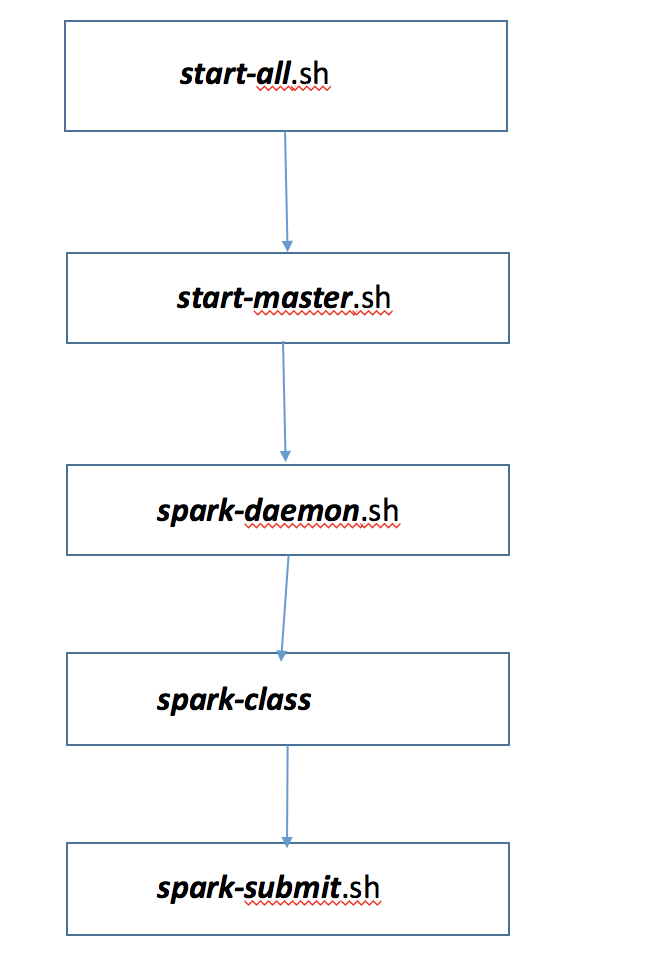

# Spark集群启动的脚本流程
## 启动脚本示意图

## 启动的脚本
### 1.start-all.sh脚本
通过/home/hadoop/spark-1.3.1-bin-hadoop2.6/sbin目录查看start-all.sh脚本,脚本主要的代码如下:
<pre><code>
# Load the Spark configuration
. "$sbin/spark-config.sh"
   
# Start Master
"$sbin"/start-master.sh $TACHYON_STR
   
# Start Workers
"$sbin"/start-slaves.sh $TACHYON_STR
</code></pre>

可以从Shell脚本中看出，首先启动Master，然后在启动Worker。

### 2.start-master.sh脚本
start-master.sh脚本的主要内容如下:
<pre><code>
. "$SPARK_PREFIX/bin/load-spark-env.sh"
# 判断配置文件中是否为空,默认为7077
if [ "$SPARK_MASTER_PORT" = "" ]; then
  SPARK_MASTER_PORT=7077
fi

if [ "$SPARK_MASTER_IP" = "" ]; then
  SPARK_MASTER_IP=`hostname`
fi
# 默认的WEBUI端口是8080
if [ "$SPARK_MASTER_WEBUI_PORT" = "" ]; then
  SPARK_MASTER_WEBUI_PORT=8080
fi

"$sbin"/spark-daemon.sh start org.apache.spark.deploy.master.Master 1 --ip $SPARK_MASTER_IP --port $SPARK_MASTER_PORT --webui-port $SPARK_MASTER_WEBUI_PORT

if [ "$START_TACHYON" == "true" ]; then
  "$sbin"/../tachyon/bin/tachyon bootstrap-conf $SPARK_MASTER_IP
  "$sbin"/../tachyon/bin/tachyon format -s
  "$sbin"/../tachyon/bin/tachyon-start.sh master
fi
</code></pre>
这里start-master.sh脚本主要是进行一些环境配置，主要包含Master的端口等，然后调用Shell脚本对org.apache.spark.deploy.master.Master进行启动。  
### 3.spark-daemon.sh脚本
spark-daemon.sh脚本用于启动Master和Worker，spark-daemon.sh脚本的内容如下:
<pre><code>
nohup nice -n $SPARK_NICENESS "$SPARK_PREFIX"/bin/spark-submit --class $command \
"${SUBMISSION_OPTS[@]}" spark-internal "${APPLICATION_OPTS[@]}" >> "$log" 2>&1 < /dev/null &
</code></pre>
脚本中启动执行的主要脚本命令是上述代码，主要通过${SPARK_HOME}/bin/spark-class启动，接下来我们看一下spark-class
### 4.spark-class脚本
spark-class脚本在bin/目录下面,主要的内容为:
<pre><code>
if [ -n "$SPARK_SUBMIT_BOOTSTRAP_DRIVER" ]; then
  # This is used only if the properties file actually contains these special configs
  # Export the environment variables needed by SparkSubmitDriverBootstrapper
  export RUNNER
  export CLASSPATH
  export JAVA_OPTS
  export OUR_JAVA_MEM
  export SPARK_CLASS=1
  shift # Ignore main class (org.apache.spark.deploy.SparkSubmit) and use our own
  exec "$RUNNER" org.apache.spark.deploy.SparkSubmitDriverBootstrapper "$@"
else
  # Note: The format of this command is closely echoed in SparkSubmitDriverBootstrapper.scala
  if [ -n "$SPARK_PRINT_LAUNCH_COMMAND" ]; then
    echo -n "Spark Command: " 1>&2
    echo "$RUNNER" -cp "$CLASSPATH" $JAVA_OPTS "$@" 1>&2
    echo -e "========================================\n" 1>&2
  fi
  exec "$RUNNER" -cp "$CLASSPATH" $JAVA_OPTS "$@"
fi
</code></pre>
spark-class脚本做的工作主要是进行Java环境的配置和比较，以及Spark环境的加载，然后启动Spark集群。
### 5.spark-submit脚本
在作业提交过程,使用的脚本是spark-submit，具体提交程序的示例如下:
<pre><code>
/bin/spark-submit \
  --class cn.edu.hust.WordCount \
  --master spark://207.184.161.138:7077 \
  --executor-memory 20G \
  --total-executor-cores 100 \
  /path/to/examples.jar \
  1000
</code></pre>
这是一个提交WordCount的程序示例。下面是spark-submit脚本
<pre><code>
exec "$SPARK_HOME"/bin/spark-class org.apache.spark.deploy.SparkSubmit "${ORIG_ARGS[@]}"
</code></pre>
从上面的脚本可以看出,这里主要调用org.apache.spark.deploy.SparkSubmit,这是Spark程序执行的入口类，所以我们
将会从这个程序开始进行源码分析。

##总结
通过Shell脚本启动Spark集群,在提交作业时,使用org.apache.spark.deploy.SparkSubmit对作业进程提交。